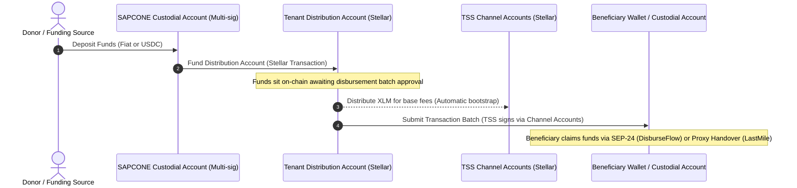
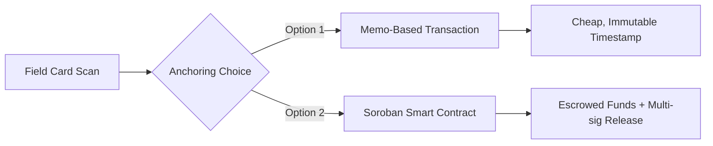

# Flow-of-Funds Design Brief & Multi-Product Roadmap (D-7)

**Product Suite:** SAPCONE Cross-Border Disbursement System  
**Scope:** Covers DisburseFlow (Product 1), LastMile (Product 2), and OpenLedger (Product 3)  
**Status:** Architectural Design Brief and Technical Roadmap for future implementation phases.

---

## 1. System-Wide Flow of Funds

The SAPCONE disbursement suite transitions cash transfers from high-risk manual handovers to transparent, auditable on-chain assets (USDC and XLM). 

Below is the ledger-level flow of funds from the initial funding source down to individual beneficiary settlement:



---

## 2. LastMile Custody Models (Phone-less Beneficiaries)

For beneficiaries who do not own a phone or live in zones with zero connectivity, the standard SDP SEP-24 client-initiated flow is impossible. We evaluate two custody models for managing their Stellar accounts:

### Option A: Individual Stellar Accounts (One Account per Receiver)
*   **Mechanism**: The system programmatically generates a unique keypair for each phone-less receiver. The secret keys are encrypted and stored in a secure custodial database vault, while the public address is mapped to their physical proxy card/NFID.
*   **Pros**:
    *   Direct, clean on-chain evidence: every receiver has a distinct on-chain balance and history.
    *   Maximum compliance: aligns with standard Web3 ownership models.
*   **Cons**:
    *   High setup costs: each account requires bootstrapping with XLM base reserve requirements (currently 1 XLM minimum + trustline reserves).
    *   High operational complexity in key management and encryption.

### Option B: Pooled Custodial Account (Distinguished by Memo)
*   **Mechanism**: All phone-less beneficiaries share a single, master custodial Stellar account managed by SAPCONE. Individual payments are sent to this pooled account, with a unique `Memo` field mapping the transaction to the specific beneficiary.
*   **Pros**:
    *   Zero account setup cost: no need to bootstrap thousands of individual wallets with XLM.
    *   Simpler key management: only one keypair needs to be vaulted and guarded.
*   **Cons**:
    *   Auditability: donors must inspect database-level logs in addition to the ledger to verify individual payouts.
    *   Single point of failure: any compromise of the master key affects all phone-less beneficiaries.

---

## 3. Proxy Delivery Anchoring (LastMile -> OpenLedger)

When a physical cash or commodity handover is performed by a Field Coordinator (approver) to a phone-less beneficiary, the delivery confirmation must be anchored on-chain to be visible to the public **OpenLedger** portal.

We evaluate two mechanisms for anchoring this proof of delivery:



### Option 1: Memo-Based Transaction Proof
*   **Mechanism**: The system sends a zero-value transaction (or minor fee payment) from a SAPCONE coordinator address to the receiver's address, attaching a hash of the delivery metadata (beneficiary ID, timestamp, card signature) in the `Memo` field.
*   **Pros**: Low transaction fees, simple code, supported out-of-the-box by Horizon.
*   **Cons**: The ledger acts only as a static log. It cannot prevent a coordinator from broadcasting false handovers before they physically occur.

### Option 2: Soroban Smart Contract Escrow
*   **Mechanism**: The TSS deposits the disbursement funds into a Soroban smart contract escrow. The contract gates release of the funds. To release them, the contract requires two signatures: the Field Coordinator's key and the beneficiary's card key (verified on-chain via smart contract cryptography).
*   **Pros**: The system enforces control; funds cannot be stolen or claimed without the physical card being present and scanned at the time of delivery.
*   **Cons**: Higher transaction costs; requires WebAssembly (WASM) execution on-chain; requires Soroban-compatible RPC nodes with shorter ledger history retention.

---

## 4. OpenLedger Privacy-Preserving Public Audit

The **OpenLedger** portal allows public donors to verify that funds reached beneficiaries without compromising beneficiary safety, violating local privacy laws, or exposing sensitive KYC information (like Date of Birth or Phone Number).

### Privacy Architecture
*   **No PII On-Chain**: No names, phone numbers, or exact locations are ever written to the public Stellar ledger.
*   **Anonymized Identifiers**: Receivers are represented on OpenLedger by cryptographically salted hashes of their IDs (`SHA-256(ReceiverID + Salt)`).
*   **Verification Flow**:
    1.  Donors receive a batch report containing the anonymized hashes and payment amounts.
    2.  Donors enter a hash into the OpenLedger portal.
    3.  OpenLedger queries the Stellar ledger using the transaction hash to confirm the transaction settled successfully on-chain, proving the funds left the distribution account and reached the receiver's cryptographic address.

---

## 5. Multi-Product Implementation Roadmap

To maintain velocity while managing architectural risks, the project is structured in three consecutive phases:

```
Phase 1: DisburseFlow (Current)
├── Setup testnet SDP instance
├── Implement SAPCONE receiver fields
└── Validate CSV upload and manual verification

Phase 2: LastMile (Q3 2026)
├── Finalize Custody Model (pooled vs. individual)
├── Implement card/NFID offline sync tool
└── Establish proxy-handover schema & API endpoints

Phase 3: OpenLedger (Q4 2026)
├── Build public verification portal (no login)
├── Wire Stellar network on-chain transaction parser
└── Integrate privacy-preserving audit hashes
```
